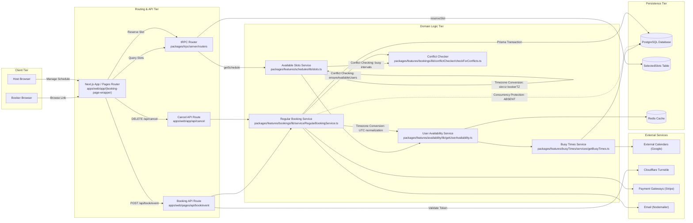

# Cal.com Architecture
A verified architectural analysis of the Cal.com system components, data flows, and state boundaries.

## Component Directory
| Component | Responsibility | Location | Evidence |
| :--- | :--- | :--- | :--- |
| Web Application | Delivers public booking UI, admin screens, and API endpoints | `apps/web` | apps/web/package.json:2 [Confirmed] |
| tRPC Routers | Type-safe procedures for slot discovery and schedule modifications | `packages/trpc/server/routers` | packages/trpc/server/routers/_app.ts:1 [Confirmed] |
| Regular Booking Service | Coordinates validation, availability checks, and booking creation | `packages/features/bookings/lib/service` | packages/features/bookings/lib/service/RegularBookingService.ts:2585 [Confirmed] |
| User Availability Service | Aggregates schedules, overrides, and external calendar busy intervals | `packages/features/availability/lib` | packages/features/availability/lib/getUserAvailability.ts:361 [Confirmed] |
| Busy Times Service | Queries internal bookings and third-party calendar providers | `packages/features/busyTimes/services` | packages/features/busyTimes/services/getBusyTimes.ts:26 [Confirmed] |
| Slot Generator | Slices continuous availability ranges into bookable intervals | `packages/features/schedules/lib` | packages/features/schedules/lib/slots.ts:71 [Confirmed] |
| Conflict Checker | Compares target time ranges against active busy windows | `packages/features/bookings/lib/conflictChecker` | packages/features/bookings/lib/conflictChecker/checkForConflicts.ts:10 [Confirmed] |
| Prisma Schema | Defines database entities, foreign keys, and indexes | `packages/prisma` | packages/prisma/schema.prisma:1 [Confirmed] |

## Where State Lives
- Database (PostgreSQL): Authoritative state for users, schedules, event types, bookings, attendees, and temporary slot holds.
  Evidence: packages/prisma/schema.prisma:10-14 [Confirmed]
- Cache (Redis): Session rate-limiting tokens and external calendar timezone lookups.
  Evidence: apps/web/package.json:83 [Confirmed], packages/features/availability/lib/getUserAvailability.ts:250-256 [Confirmed]
- Browser: Active calendar view dates, selected time slots, and slot reservation cookie UID.
  Evidence: packages/features/bookings/Booker/store.ts:1-50 [Confirmed], packages/trpc/server/routers/viewer/slots/reserveSlot.handler.ts:26 [Confirmed]
- Server Process: In-memory trace contexts and request metadata during execution lifecycle.
  Evidence: packages/features/bookings/lib/service/RegularBookingService.ts:511-520 [Confirmed]
- External Services: Third-party calendar busy events in Google Calendar and payment intents in Stripe.
  Evidence: apps/web/package.json:58,79-80 [Confirmed]

## Observed Design Decisions
| Decision | How it is implemented | Evidence |
| :--- | :--- | :--- |
| Slot Generation via Set Subtraction | Date ranges are generated from working hours and busy intervals are subtracted using interval arithmetic | packages/features/availability/lib/getUserAvailability.ts:648-649 [Confirmed] |
| Date Overrides by Key Overwrite | Date overrides are indexed by date string and spread over working hours to overwrite default day ranges | packages/features/schedules/lib/date-ranges.ts:312-314 [Confirmed] |
| Pre/Post Meeting Buffer Inversion | Buffers before/after events are added directly onto existing booking busy intervals to push adjacent slots away | packages/features/busyTimes/services/getBusyTimes.ts:135-136,177-178 [Confirmed] |
| Optimistic Slot Reservations | `SelectedSlots` holds slots temporarily via cookie identifiers without verifying them during booking creation | packages/trpc/server/routers/viewer/slots/reserveSlot.handler.ts:84-100 [Confirmed] |
| In-Memory Conflict Detection | Conflict checks execute in Node.js application memory prior to database insertion rather than via database constraints | packages/features/bookings/lib/conflictChecker/checkForConflicts.ts:39-47 [Confirmed] |
| Destructive Schedule Updates | Updating an existing schedule executes a `deleteMany` on its availability records followed by `createMany` | packages/features/schedules/services/ScheduleService.ts:121-137 [Confirmed] |
| Standardized Canadian Date Formatting | Slots group by date using Canadian French (`fr-CA`) format to yield ISO date keys (`YYYY-MM-DD`) | packages/trpc/server/routers/viewer/slots/util.ts:1246-1250 [Confirmed] |
