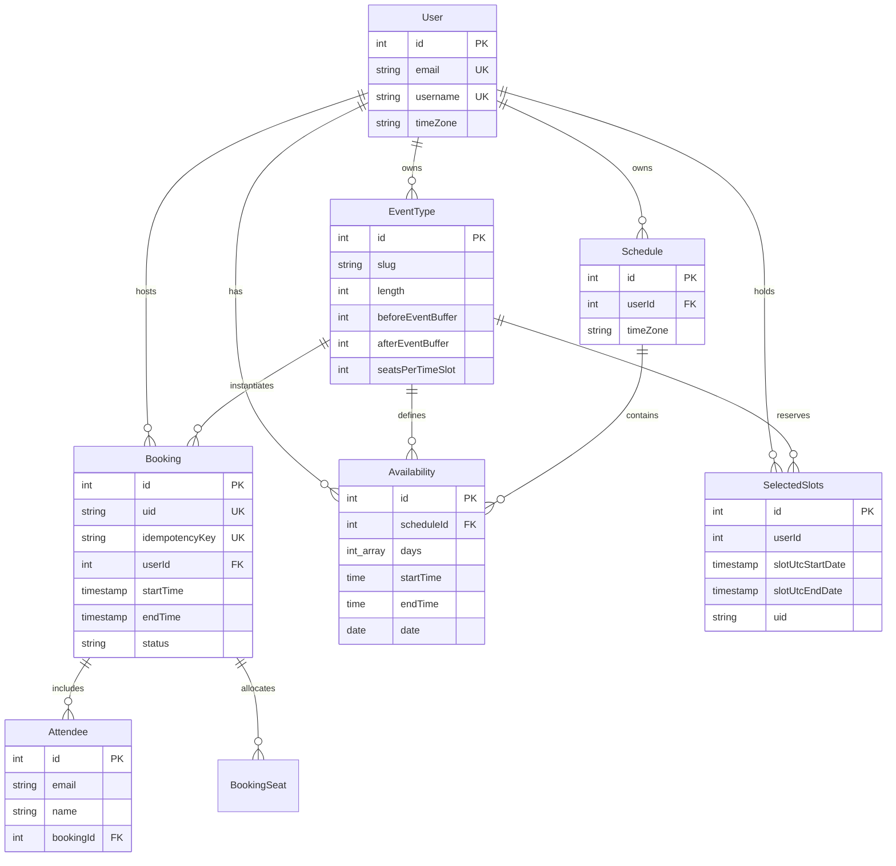

# Cal.com Data Model
A verified schema specification of the Cal.com scheduling models, database relationships, and table constraints.

## Scheduling & Booking Core Models

### Model: Booking
- Purpose: Stores scheduled meeting records, time windows, and lifecycle statuses.
  Evidence: packages/prisma/schema.prisma:851-930 [Confirmed]
- Relationships: Belongs to `User` (host), `EventType`; has many `Attendee`, `BookingReference`.
  Evidence: packages/prisma/schema.prisma:856,862,871 [Confirmed]
- Constraints: PK `id`, unique `uid`, `idempotencyKey`, `oneTimePassword`.
  Evidence: packages/prisma/schema.prisma:852,853,855,903 [Confirmed]
- Indexes: `[eventTypeId]`, `[userId]`, `[status]`, `[startTime, endTime, status]`, `[userId, status, startTime]`.
  Evidence: packages/prisma/schema.prisma:918-929 [Confirmed]

| Field | Type | Required | Key | Notes | Evidence |
| :--- | :--- | :--- | :--- | :--- | :--- |
| `id` | Int | Yes | PK | Primary surrogate key | packages/prisma/schema.prisma:852 |
| `uid` | String | Yes | Unique | Public string identifier | packages/prisma/schema.prisma:853 |
| `idempotencyKey` | String | No | Unique | Null in regular bookings | packages/prisma/schema.prisma:855 |
| `userId` | Int | No | FK | Host user reference ID | packages/prisma/schema.prisma:857 |
| `eventTypeId` | Int | No | FK | Event type template ID | packages/prisma/schema.prisma:863 |
| `title` | String | Yes | None | Meeting event title | packages/prisma/schema.prisma:864 |
| `startTime` | DateTime | Yes | Index | Meeting start timestamp in UTC | packages/prisma/schema.prisma:869 |
| `endTime` | DateTime | Yes | Index | Meeting end timestamp in UTC | packages/prisma/schema.prisma:870 |
| `status` | BookingStatus | Yes | Index | Enum: ACCEPTED, CANCELLED, REJECTED, PENDING | packages/prisma/schema.prisma:875 |
| `fromReschedule` | String | No | Index | Previous booking UID when rescheduled | packages/prisma/schema.prisma:888 |

### Model: Attendee
- Purpose: Represents invitees and participants linked to a booking.
  Evidence: packages/prisma/schema.prisma:826-841 [Confirmed]
- Relationships: Belongs to `Booking` with cascade on delete.
  Evidence: packages/prisma/schema.prisma:833 [Confirmed]
- Constraints & Indexes: PK `id`; indexes `[email]`, `[bookingId]`, `[email, bookingId]`.
  Evidence: packages/prisma/schema.prisma:827,838-840 [Confirmed]

| Field | Type | Required | Key | Notes | Evidence |
| :--- | :--- | :--- | :--- | :--- | :--- |
| `id` | Int | Yes | PK | Primary key | packages/prisma/schema.prisma:827 |
| `email` | String | Yes | Index | Invitee email address | packages/prisma/schema.prisma:828 |
| `name` | String | Yes | None | Invitee full name | packages/prisma/schema.prisma:829 |
| `timeZone` | String | Yes | None | Invitee local IANA timezone | packages/prisma/schema.prisma:830 |
| `bookingId` | Int | No | FK | Reference to parent booking | packages/prisma/schema.prisma:834 |

### Model: Schedule
- Purpose: Groups recurring availability and date overrides under an organizer profile.
  Evidence: packages/prisma/schema.prisma:945-958 [Confirmed]
- Relationships: Belongs to `User`, has many `Availability` entries and `EventType` templates.
  Evidence: packages/prisma/schema.prisma:947,949,954 [Confirmed]
- Constraints & Indexes: PK `id`; index `[userId]`.
  Evidence: packages/prisma/schema.prisma:946,957 [Confirmed]

| Field | Type | Required | Key | Notes | Evidence |
| :--- | :--- | :--- | :--- | :--- | :--- |
| `id` | Int | Yes | PK | Primary key | packages/prisma/schema.prisma:946 |
| `userId` | Int | Yes | FK | Schedule owner user ID | packages/prisma/schema.prisma:948 |
| `name` | String | Yes | None | User-assigned schedule title | packages/prisma/schema.prisma:952 |
| `timeZone` | String | No | None | Schedule-level IANA timezone | packages/prisma/schema.prisma:953 |

### Model: Availability
- Purpose: Stores recurring weekly open hours or specific calendar date overrides.
  Evidence: packages/prisma/schema.prisma:960-976 [Confirmed]
- Relationships: Belongs to `Schedule`, belongs to `User`, belongs to `EventType`.
  Evidence: packages/prisma/schema.prisma:962,964,970 [Confirmed]
- Constraints & Indexes: PK `id`; indexes `[userId]`, `[eventTypeId]`, `[scheduleId]`.
  Evidence: packages/prisma/schema.prisma:961,973-975 [Confirmed]

| Field | Type | Required | Key | Notes | Evidence |
| :--- | :--- | :--- | :--- | :--- | :--- |
| `id` | Int | Yes | PK | Primary key | packages/prisma/schema.prisma:961 |
| `userId` | Int | No | FK | Optional direct user link | packages/prisma/schema.prisma:963 |
| `scheduleId` | Int | No | FK | Parent schedule ID | packages/prisma/schema.prisma:971 |
| `days` | Int[] | Yes | None | Weekday numbers (0=Sunday to 6=Saturday) | packages/prisma/schema.prisma:966 |
| `startTime` | DateTime | Yes | None | Opening time (DB Time) | packages/prisma/schema.prisma:967 |
| `endTime` | DateTime | Yes | None | Closing time (DB Time) | packages/prisma/schema.prisma:968 |
| `date` | DateTime | No | None | Date for specific overrides | packages/prisma/schema.prisma:969 |

### Model: EventType
- Purpose: Configuration template defining meeting durations, buffers, and scheduling logic.
  Evidence: packages/prisma/schema.prisma:156-306 [Confirmed]
- Relationships: Owned by `User`, belongs to `Team`, links to `Schedule`, has many `Booking` entries.
  Evidence: packages/prisma/schema.prisma:174,180,183 [Confirmed]
- Constraints & Indexes: PK `id`; unique `[userId, slug]`, `[teamId, slug]`; indexes `[userId]`, `[scheduleId]`.
  Evidence: packages/prisma/schema.prisma:295-301 [Confirmed]

| Field | Type | Required | Key | Notes | Evidence |
| :--- | :--- | :--- | :--- | :--- | :--- |
| `id` | Int | Yes | PK | Primary key | packages/prisma/schema.prisma:157 |
| `title` | String | Yes | None | Event name shown to bookers | packages/prisma/schema.prisma:159 |
| `slug` | String | Yes | Unique | URL slug under user/team path | packages/prisma/schema.prisma:161 |
| `length` | Int | Yes | None | Event duration in minutes | packages/prisma/schema.prisma:168 |
| `beforeEventBuffer` | Int | Yes | None | Buffer minutes preceding meeting | packages/prisma/schema.prisma:220 |
| `afterEventBuffer` | Int | Yes | None | Buffer minutes succeeding meeting | packages/prisma/schema.prisma:221 |
| `seatsPerTimeSlot` | Int | No | None | Capacity limit for seated events | packages/prisma/schema.prisma:222 |

### Model: SelectedSlots
- Purpose: Records temporary slot reservation holds placed by prospective bookers.
  Evidence: packages/prisma/schema.prisma:1437-1448 [Confirmed]
- Relationships: Integer references to `userId` and `eventTypeId` without foreign keys.
  Evidence: packages/prisma/schema.prisma:1439-1440 [Confirmed]
- Constraints: PK `id`; unique `[userId, slotUtcStartDate, slotUtcEndDate, uid]` named `selectedSlotUnique`.
  Evidence: packages/prisma/schema.prisma:1447 [Confirmed]

| Field | Type | Required | Key | Notes | Evidence |
| :--- | :--- | :--- | :--- | :--- | :--- |
| `id` | Int | Yes | PK | Primary key | packages/prisma/schema.prisma:1438 |
| `eventTypeId` | Int | Yes | None | Event type identifier | packages/prisma/schema.prisma:1439 |
| `userId` | Int | Yes | None | Host user identifier | packages/prisma/schema.prisma:1440 |
| `slotUtcStartDate` | DateTime | Yes | Unique | Reserved slot start time in UTC | packages/prisma/schema.prisma:1441 |
| `slotUtcEndDate` | DateTime | Yes | Unique | Reserved slot end time in UTC | packages/prisma/schema.prisma:1442 |
| `uid` | String | Yes | Unique | Booker client reservation UUID | packages/prisma/schema.prisma:1443 |
| `releaseAt` | DateTime | Yes | None | Expiration timestamp | packages/prisma/schema.prisma:1444 |

### Model: User
- Purpose: Represents registered host account with profile settings and default schedule.
  Evidence: packages/prisma/schema.prisma:401-522 [Confirmed]
- Relationships: Has many `Schedule`, `EventType`, `Booking`, and `Credential` records.
  Evidence: packages/prisma/schema.prisma:461,466,470 [Confirmed]
- Constraints & Indexes: PK `id`; unique `email`, `username`; indexes `[email]`, `[username]`.
  Evidence: packages/prisma/schema.prisma:404,407,514-515 [Confirmed]

| Field | Type | Required | Key | Notes | Evidence |
| :--- | :--- | :--- | :--- | :--- | :--- |
| `id` | Int | Yes | PK | Primary key | packages/prisma/schema.prisma:402 |
| `email` | String | Yes | Unique | Host primary email address | packages/prisma/schema.prisma:404 |
| `username` | String | No | Unique | Public handle for URLs | packages/prisma/schema.prisma:407 |
| `timeZone` | String | Yes | None | Default IANA user timezone | packages/prisma/schema.prisma:424 |
| `defaultScheduleId`| Int | No | None | Pointer to default schedule | packages/prisma/schema.prisma:462 |

## Other Verified Models
| Model | Purpose | Evidence |
| :--- | :--- | :--- |
| `Host` | Links team members to team event types with priority and weights | packages/prisma/schema.prisma:61-85 [Confirmed] |
| `DestinationCalendar` | Stores external calendar targets where created bookings are inserted | packages/prisma/schema.prisma:351-365 [Confirmed] |
| `BookingReference` | Tracks third-party calendar event IDs and meeting IDs per booking | packages/prisma/schema.prisma:801-815 [Confirmed] |
| `BookingSeat` | Links individual attendees to shared seated bookings | packages/prisma/schema.prisma:1422-1435 [Confirmed] |
| `SelectedCalendar` | Designates which external calendars are queried for busy times | packages/prisma/schema.prisma:978-994 [Confirmed] |
| `OutOfOfficeEntry` | Designates date ranges when a host is unavailable due to OOO or holidays | packages/prisma/schema.prisma:1788-1808 [Confirmed] |

## Constraints Relevant to Double Booking
- Existing Database Constraints:
  - `Booking.uid` has `@unique` constraint preventing duplicate booking UIDs.
    Evidence: packages/prisma/schema.prisma:853 [Confirmed]
  - `Booking.idempotencyKey` has `@unique` constraint but is left `null` by regular booking creation.
    Evidence: packages/prisma/schema.prisma:855 [Confirmed], packages/features/bookings/lib/service/RegularBookingService.ts:1539 [Confirmed]
  - `SelectedSlots` has unique constraint on `[userId, slotUtcStartDate, slotUtcEndDate, uid]`.
    Evidence: packages/prisma/schema.prisma:1447 [Confirmed]
- Missing Constraints & Indexes:
  - No database unique constraint exists on `Booking` for `[userId, startTime, endTime]`.
    Evidence: packages/prisma/schema.prisma:918-930 [Confirmed]
  - No database exclusion constraint exists preventing overlapping meeting ranges `[startTime, endTime)`.
    Evidence: packages/prisma/schema.prisma:918-930 [Confirmed]
  - `Booking` contains only non-unique composite indexes on `[userId, status, startTime]` and `[startTime, endTime, status]`.
    Evidence: packages/prisma/schema.prisma:924,927 [Confirmed]
